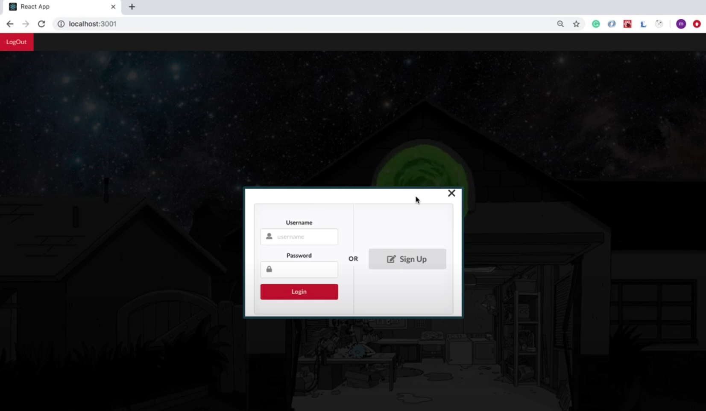
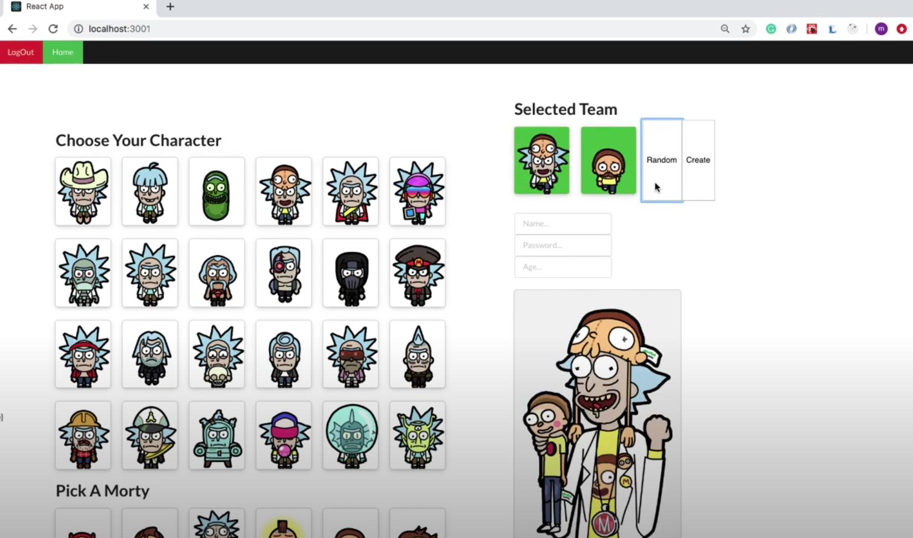
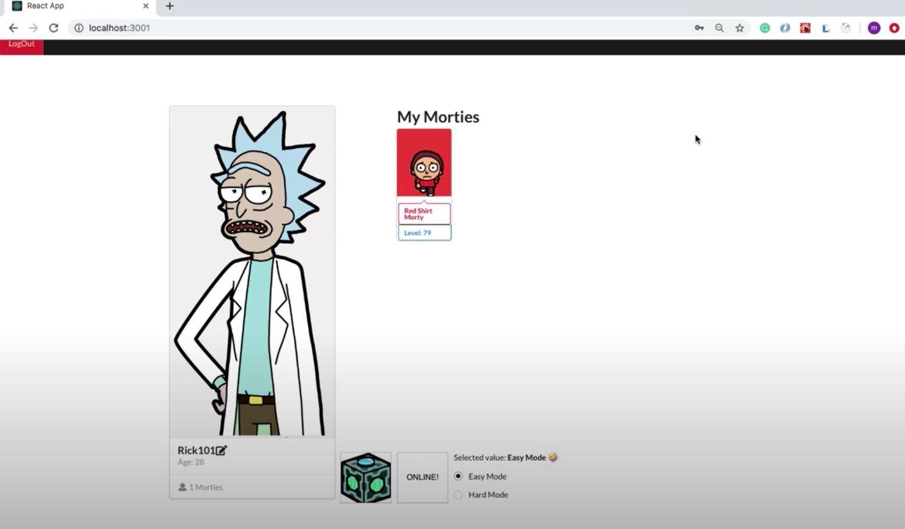
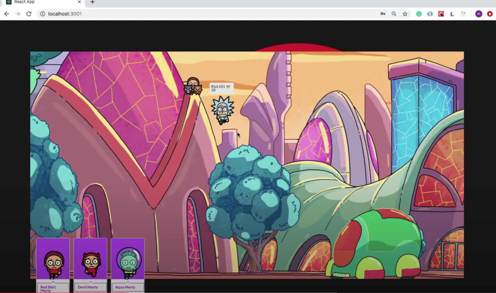
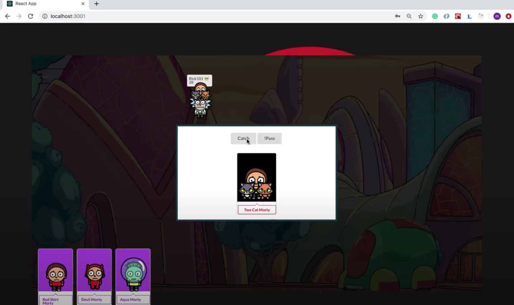
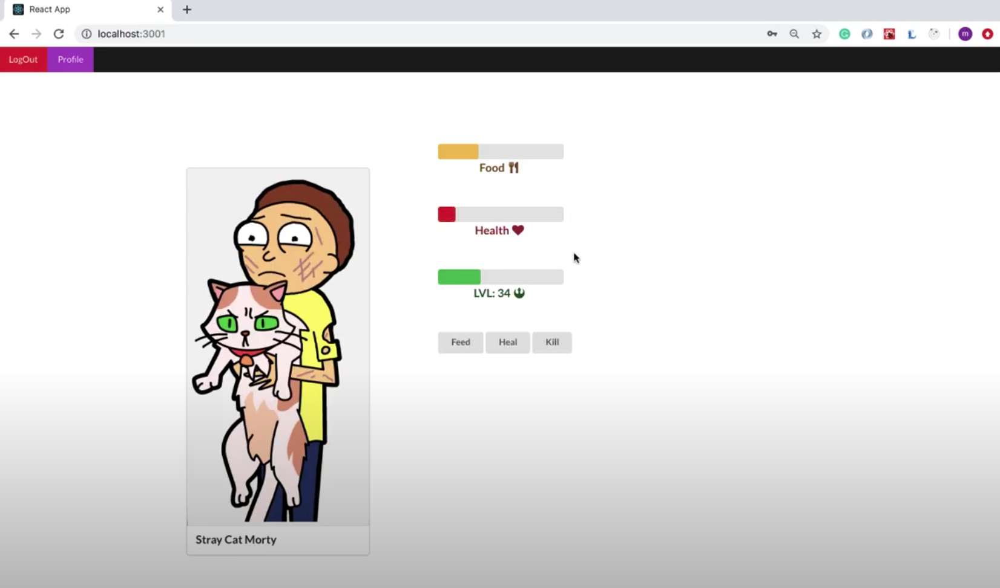

&nbsp; &nbsp; &nbsp; &nbsp; 

## Rick and Morty Adventures 

&nbsp;

## Table of contents
* [General info](#general-info)
* [Technologies](#technologies)
* [images](#images)

## General info

Rick and Morty Adventures is an rpg game that allows you to play as Rick and capture different Morties. In addition, users have to look after each Morty they capture and help them level up by keeping them healthy and fed.
	
## Technologies

Project is created with:
* React version: 16.8
* Semantic-ui-react version: 0.87
* Ruby version: 2.6

## Images

##### Login 
 

##### New Character 
 

##### Profile 
 

##### Stage
 

##### Morty Hunting
 

##### Morty Stats
 

